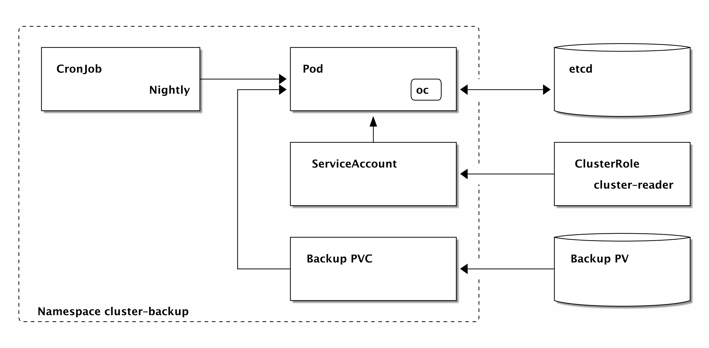
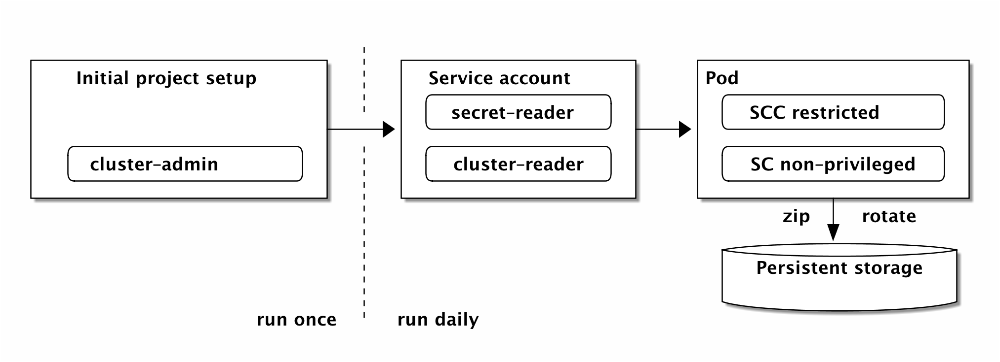

# OpenShift cluster backup




This project sets up a CronJob running the basic project backup script [project_export.sh on GitHub](https://raw.githubusercontent.com/gerald1248/openshift-ansible-contrib/refactor_export/reference-architecture/day2ops/scripts/project_export.sh).
The basic project backup script will only backup v1 api version objects, to get a list of backed up objects see [scripts/project_export.sh Line 2-5](/scripts/project_export.sh#L2-L5).

Please note that no attempt is made to back up the contents of databases or mounted persistent volumes. This backup focuses on the API objects stored in `etcd`.

Admin access is required at the start (to create project and the `cluster-reader` and `secret-reader` ClusterRoleBindings for the service account), but from then on access is strictly controlled.

**NOTE** `secret-reader` is only needed if you intent to backup Secrets. To not backup Secrets, use the [`template-no-secret-backup.yml`](/openshift/template-no-secret.yml). The [`template.yml`](/openshift/template.yml) will backup Secrets and other objects.



## Environment variables

See the [`exports`](/exports) file for an example, which can directly be used with [Set the timer](#set-the-timer).

| Name                         | Default            | Description                                                                    |
| ---------------------------- | ------------------ | ------------------------------------------------------------------------------ |
| `BACKUP_SECRETS`             | `true`             | If Secrets should also be backed up.                                           |
| `OPENSHIFT_BACKUP_NAME`      | `openshift-backup` | Name of each API object                                                        |
| `OPENSHIFT_BACKUP_NAMESPACE` | `cluster-backup`   | The project that is created for the test runner                                |
| `OPENSHIFT_BACKUP_CAPACITY`  | `2Gi`              | Create a PersistentVolumeClaim with this size and use it to store the backups. |
| `OPENSHIFT_BACKUP_SCHEDULE`  | `15 0 * * *`       | The schedule at which the backup CronJob will be run.                          |

## Set the timer
```
$ make
```

## On-demand backups
In addition to the CronJob running nightly backups, you can trigger a backup any time by opening a remote shell on the pod. This pod is also useful for retrieving (and restoring!) what you have backed up.

Let's start by backing up all projects in your cluster:

```
$ oc project
Using project "cluster-backup" on server "https://127.0.0.1:8443".
$ POD=$(oc get po | grep openshift-backup.*Running | head -n1 | awk '{ print $1 }')
$ oc rsh ${POD} openshift-backup
Processing 'myproject'
Exporting namespace to api-guidelines/ns.json
Exporting rolebindings to api-guidelines/rolebindings.json
Exporting serviceaccounts to api-guidelines/serviceaccounts.json
...
```

## Build your own Docker image
You can skip this step if you're happy to use the Docker Hub image that accompanies this repo (`gerald1248/openshift-backup`).

```
$ make build-docker-image
```

The current version is built from this repo. It sacrifices the small footprint of the Alpine-based original for readily installable `oc` binaries and CentOS/RHEL compatibility.

## Cleanup
Call `make clean` to remove the project `cluster-backup` and the rolebinding that gives the serviceaccount `openshift-backup` read-only access to all projects.

## Run the tests
These are only present as a scaffold for now, run:
```
$ make test
```
